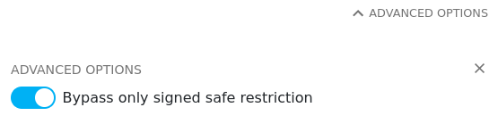

# Repository structure

There are two repositories:

- official: https://github.com/dappnode/DAppNodePackage-Hopr
- internal: https://github.com/hoprnet/DAppNodePackage-Hopr

The `internal` is a fork of the `official` one. 

Tha development happens on the internal repository and it has two branches:

- `develop` which contains the edge version, not meant for publishing
- `main` which is supposed to be in-sync with the `main` branch on the `official` repo


PRs are only meant to be made from the `internal` repo's `main` branch to the `official` repo's `main` branch.

# Development process

Clone the repo

```sh
git clone git@github.com:hoprnet/DAppNodePackage-Hopr.git
```

Build a package with (requires Node.js)

```sh
npx @dappnode/dappnodesdk build
```

This should create output similar to

```
  ✔ Verify connection
  ✔ Verify connection
  ✔ Create release dir
  ✔ Validate files
  ✔ Copy files
  ✔ Build architecture linux/amd64
  ✔ Upload release to IPFS node
  ✔ Save upload results

  DNP (DAppNode Package) built and uploaded 
  Release hash : /ipfs/QmdZHJPrTJQZRr9gJKhQKXVSVSRf3jdBj6LqbZuZ8MNSWF
  http://my.dappnode/installer/public/%2Fipfs%2FQmdZHJPrTJQZRr9gJKhQKXVSVSRf3jdBj6LqbZuZ8MNSWF
```

When connected to a DAppnode system, follow the link and install the package. If it is a development build, make sure to disable signature verification before installing the package.



# Useful links

- [Official documentation](https://docs.dappnode.io/docs/dev)
- [http://my.dappnode/public-packages](http://my.dappnode/public-packages) lists installed public packages
- [http://my.dappnode/package-manifest/hopr.public.dappnode.eth](http://my.dappnode/package-manifest/hopr.public.dappnode.eth) gets the internal view of the package metadata

When running with the [DMS package](http://my.dappnode/installer/dnp/dms.dnp.dappnode.eth) (Grafana, Loki, Prometheus):

- [http://prometheus.dms.dappnode:9090/targets](http://prometheus.dms.dappnode:9090/targets) lists Prometheus targets. Make sure the package's target is available

Automatic import of Prometheus targets is only available if `prometheusTargets` and automatic import of Grafana dashboards is only available if `grafanaDashboards` is present in the observed [package manifest](http://my.dappnode/package-manifest/hopr.public.dappnode.eth)